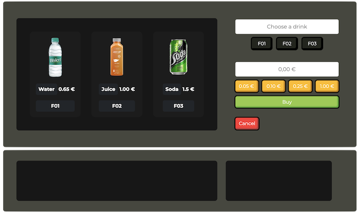

# Vending Machine PHP

This is my solution to a vending machine using PHP and jQuery that runs in a Docker container.



# Installation

On root folder of the project run

```bash
docker compose up
```

# Folder structure

```php
# ./
Contains the Docker configurations files

# db/
Contains the seed.sql file wiche create and insert data to the database

# docker/
Generated folder which container all the configuration for the mysql server and phpmyadmin

# src/
Contains the project source files

# src/assets
Contains images

# src/database
db global conection

# src/functions
Contains the two principal functions of the project CreateMachine and Vending

# src/utils
Contains js and style files
```
## Missing functionality
```
- Give change in the available coins 
- A service person opens the machine and set the available change and how many items we have.
```

## Autor

Hayk Petrosyan
